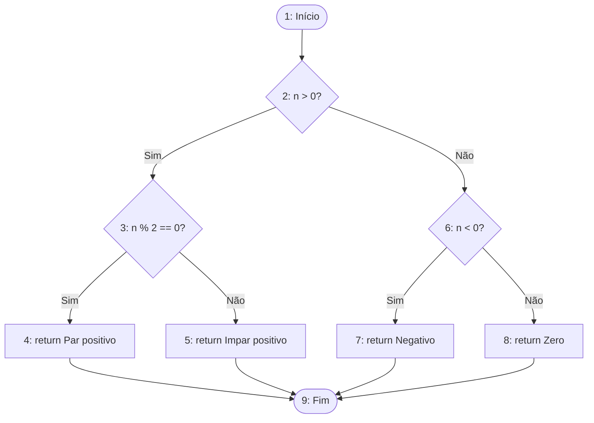
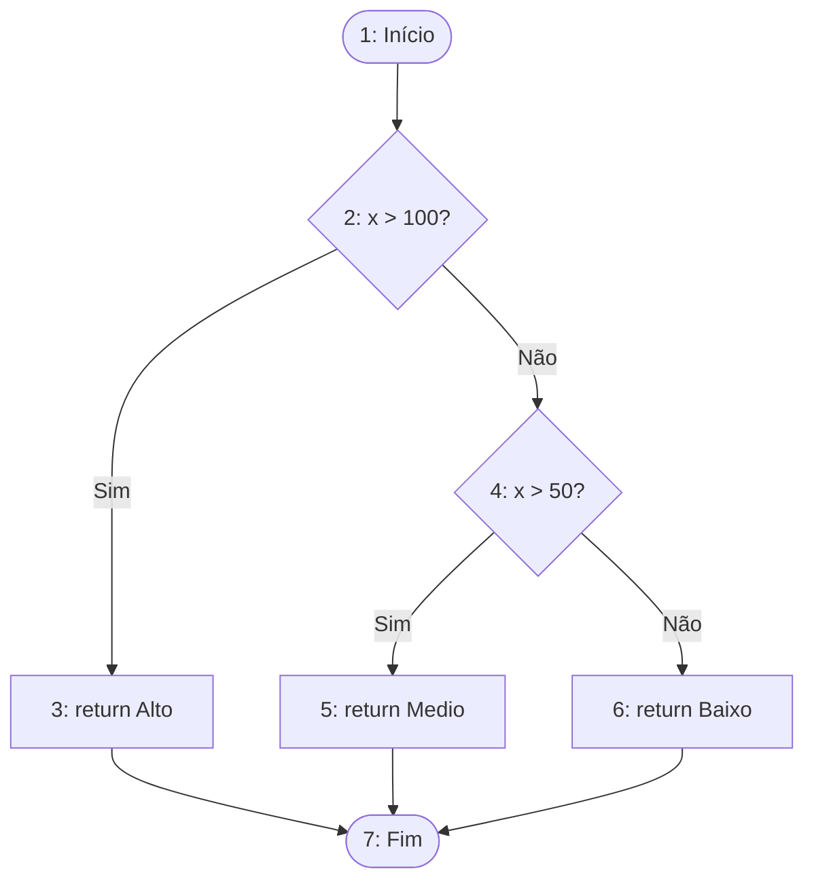
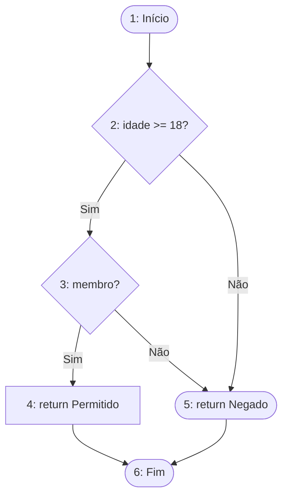
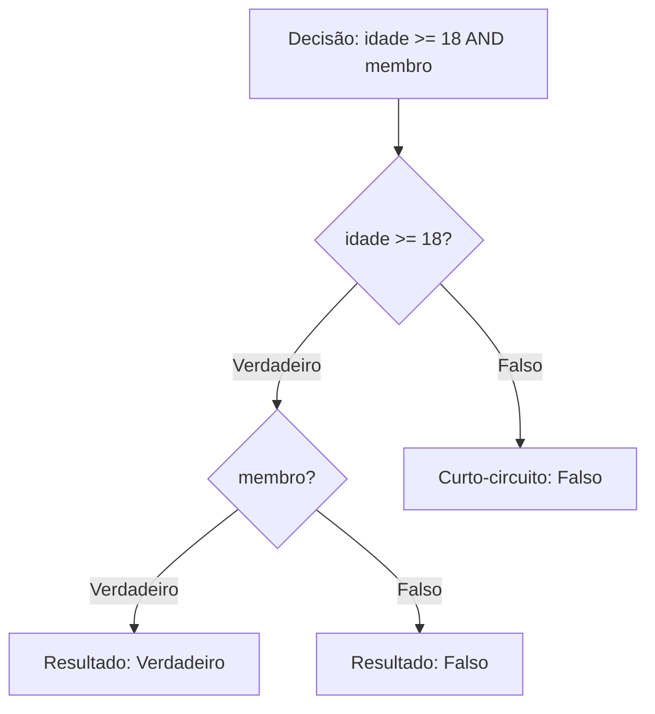
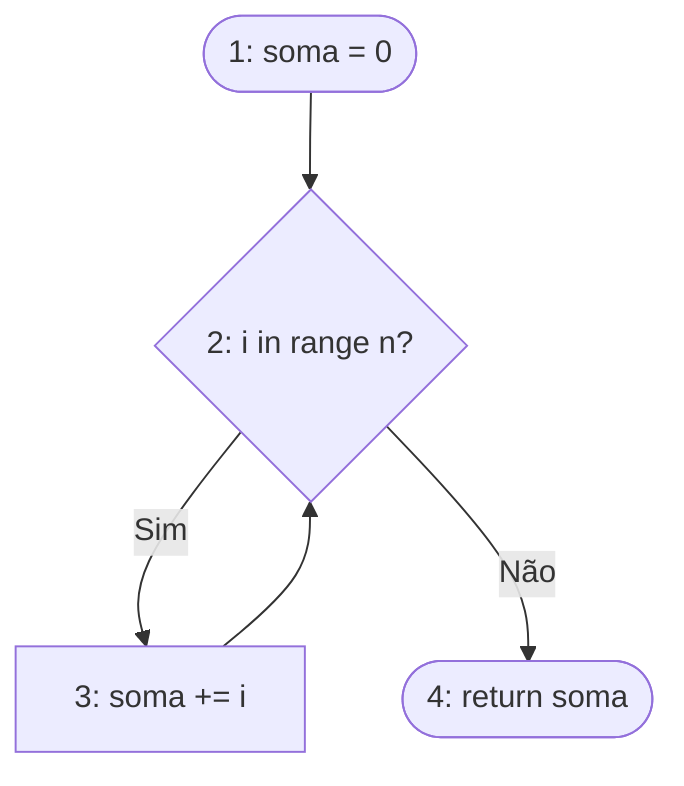
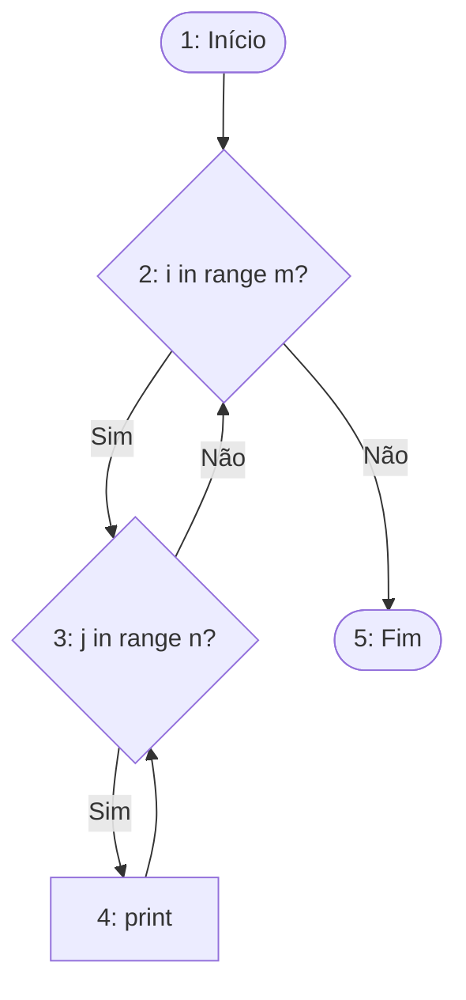
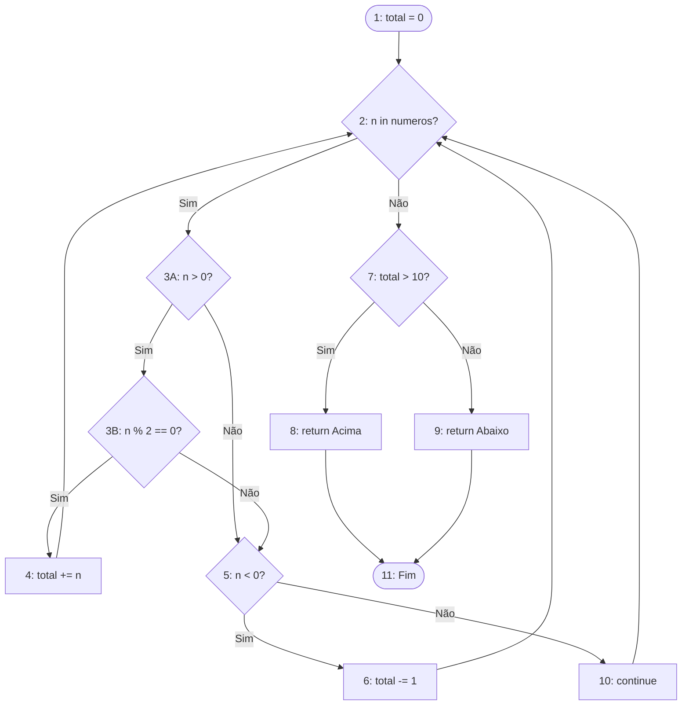
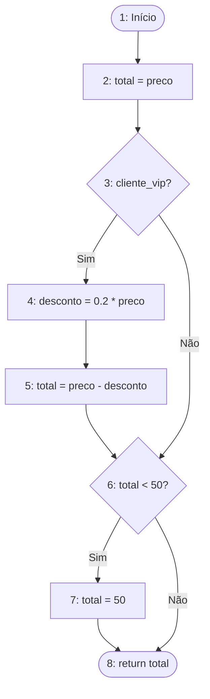

Exercício 1: Caminhos Independentes 

**Código:**

```python
def verificar(n):
    if n > 0:
        if n % 2 == 0:
            return "Par positivo"
        else:
            return "Impar positivo"
    elif n < 0:
        return "Negativo"
    else:
        return "Zero"

```

### 1. Grafo de Fluxo de Controle (GFC)



### 2. Complexidade Ciclomática e Caminhos

* **Complexidade Ciclomática $V(G)$:** $V(G) = 4$ (3 nós de decisão + 1).
* **Caminhos Independentes:**
* **C1:** 1 $\rightarrow$ 2 $\rightarrow$ 3 $\rightarrow$ 4 $\rightarrow$ 9
* **C2:** 1 $\rightarrow$ 2 $\rightarrow$ 3 $\rightarrow$ 5 $\rightarrow$ 9
* **C3:** 1 $\rightarrow$ 2 $\rightarrow$ 6 $\rightarrow$ 7 $\rightarrow$ 9
* **C4:** 1 $\rightarrow$ 2 $\rightarrow$ 6 $\rightarrow$ 8 $\rightarrow$ 9


### 3. Casos de Teste (CTs)

* **CT1 (C1):** `n = 2` $\rightarrow$ Saída Esperada: "Par positivo"
* **CT2 (C2):** `n = 3` $\rightarrow$ Saída Esperada: "Impar positivo"
* **CT3 (C3):** `n = -5` $\rightarrow$ Saída Esperada: "Negativo"
* **CT4 (C4):** `n = 0` $\rightarrow$ Saída Esperada: "Zero"

---

Exercício 2: Cobertura de Comandos e Ramos 

**Código:**

```python
def classificar(x):
    if x > 100:
        return "Alto"
    if x > 50:
        return "Medio"
    return "Baixo"

```

### 1. Grafo de Fluxo de Controle (GFC)



### 2. Complexidade Ciclomática e Caminhos

* **Complexidade Ciclomática $V(G)$:** $V(G) = 3$ (2 nós de decisão + 1).
* **Caminhos Independentes:**
* **C1:** 1 $\rightarrow$ 2 $\rightarrow$ 3 $\rightarrow$ 7
* **C2:** 1 $\rightarrow$ 2 $\rightarrow$ 4 $\rightarrow$ 5 $\rightarrow$ 7
* **C3:** 1 $\rightarrow$ 2 $\rightarrow$ 4 $\rightarrow$ 6 $\rightarrow$ 7


3. Testes para CO e C1 e Justificativa 

* **CT1:** `x = 150` (Cobre o caminho C1 e o nó 3)
* **CT2:** `x = 75` (Cobre o caminho C2 e o nó 5)
* **CT3:** `x = 20` (Cobre o caminho C3 e o nó 6)
* **Justificativa:** São necessários exatamente **3 CTs**. Como a complexidade ciclomática é 3, testar esses três caminhos independentes garante que todas as arestas (Ramos/C1) e todos os nós (Comandos/C0) sejam executados pelo menos uma vez. A Cobertura de Ramos (C1) subsume a Cobertura de Comandos (C0).

---

Exercício 3: Cobertura de Condição 

**Código:**

```python
def acesso(idade, membro):
    if idade >= 18 and membro:
        return "Permitido"
    return "Negado"

```

### 1. Grafo de Fluxo de Controle e Árvore de Condição



**Árvore da Condição Múltipla (AND):**



### 2. Complexidade Ciclomática e Caminhos

* **Complexidade Ciclomática $V(G)$:** $V(G) = 3$ (As duas condições atômicas são desmembradas em dois nós de desvio distintos).
* **Caminhos Independentes:**
* **C1:** 1 $\rightarrow$ 2 $\rightarrow$ 3 $\rightarrow$ 4 $\rightarrow$ 6
* **C2:** 1 $\rightarrow$ 2 $\rightarrow$ 3 $\rightarrow$ 5 $\rightarrow$ 6
* **C3:** 1 $\rightarrow$ 2 $\rightarrow$ 5 $\rightarrow$ 6


3. Casos de Teste (Cobertura de Condição - CC) 

Explorando todas as combinações atômicas (V/F) para `idade >= 18` e `membro`:

1. `idade = 20` (V), `membro = True` (V) $\rightarrow$ Retorno: "Permitido"
2. `idade = 20` (V), `membro = False` (F) $\rightarrow$ Retorno: "Negado"
3. `idade = 15` (F), `membro = True` (V) $\rightarrow$ Retorno: "Negado"
4. `idade = 15` (F), `membro = False` (F) $\rightarrow$ Retorno: "Negado"

4. Comparação CC vs C1 

Para atingir a Cobertura de Ramos (C1), precisaria de apenas **2 CTs** (um que torne a expressão inteira Verdadeira e outro Falsa). Para a Cobertura de Condição (CC), precisa de **4 CTs**. Eles diferem porque o critério CC exige testar os valores lógicos (V/F) de **cada subcondição isoladamente**, enquanto o C1 apenas avalia o resultado final da expressão do `if`.

---

Exercício 4: Teste de Ciclo 

**Código:**

```python
def somar_ate(n):
    soma = 0
    for i in range(n):
        soma += i
    return soma

```

### 1. Grafo de Fluxo de Controle (GFC)



### 2. Complexidade Ciclomática e Caminhos

* **Complexidade Ciclomática $V(G)$:** $V(G) = 2$ (1 laço de repetição + 1).
* **Caminhos Independentes:**
* **C1:** 1 $\rightarrow$ 2 $\rightarrow$ 4
* **C2:** 1 $\rightarrow$ 2 $\rightarrow$ 3 $\rightarrow$ 2 $\rightarrow$ 4


3. Testes de Laço e Saídas Esperadas 

* **Laço ignorado (0 iterações):** `n = 0` $\rightarrow$ Saída Esperada: **0**
* **Laço executado uma única vez:** `n = 1` $\rightarrow$ Saída Esperada: **0**
* **Laço executado várias vezes:** `n = 4` $\rightarrow$ Saída Esperada: **6** (0 + 1 + 2 + 3)

---

Exercício 5: Teste de Ciclo Aninhado 

**Código:**

```python
def percorrer_matriz(m, n):
    for i in range(m):
        for j in range(n):
            print(f"Posicao ({i}, {j})")

```

### 1. Grafo de Fluxo de Controle (GFC)



### 2. Complexidade Ciclomática e Caminhos

* **Complexidade Ciclomática $V(G)$:** $V(G) = 3$ (2 laços aninhados + 1).
* **Caminhos Independentes:**
* **C1:** 1 $\rightarrow$ 2 $\rightarrow$ 5
* **C2:** 1 $\rightarrow$ 2 $\rightarrow$ 3 $\rightarrow$ 2 $\rightarrow$ 5
* **C3:** 1 $\rightarrow$ 2 $\rightarrow$ 3 $\rightarrow$ 4 $\rightarrow$ 3 $\rightarrow$ 2 $\rightarrow$ 5


3. Cenários e Execuções do `print` 

* **Ambos os laços são ignorados (`m = 0, n = 0`):** `print` executado **0** vezes.
* **Apenas o laço j é ignorado (`m = 2, n = 0`):** `print` executado **0** vezes.
* **Um laço executa uma vez e outro várias vezes (`m = 1, n = 3`):** `print` executado **3** vezes.
* **Ambos os laços executam várias vezes (`m = 3, n = 3`):** `print` executado **9** vezes.

---

Exercício 6: Teste Completo (Integrador) 

**Código:**

```python
def analisar(numeros):
    total = 0
    for n in numeros:
        if n > 0 and n % 2 == 0:
            total += n
        elif n < 0:
            total -= 1
        else:
            continue
    if total > 10:
        return "Acima"
    return "Abaixo"

```
### 1. Grafo de Fluxo de Controle (GFC)



### 2. Complexidade Ciclomática e Caminhos Atualizados

* **Complexidade Ciclomática $V(G)$:** $V(G) = 6$
*(Contando as decisões agora fica claro: 1 laço + 4 perguntas lógicas + 1 = 6)*.
* **Caminhos Independentes Principais (Rotas de Teste):**
* **C1:** 1 $\rightarrow$ 2(F) $\rightarrow$ 7(F) $\rightarrow$ 9 $\rightarrow$ 11 *(Lista vazia, pula tudo e dá Abaixo)*
* **C2:** 1 $\rightarrow$ 2 $\rightarrow$ 3A(V) $\rightarrow$ 3B(V) $\rightarrow$ 4 $\rightarrow$ 2... $\rightarrow$ 7(V) $\rightarrow$ 8 $\rightarrow$ 11 *(Entra no positivo e par, soma, dá Acima)*
* **C3:** 1 $\rightarrow$ 2 $\rightarrow$ 3A(V) $\rightarrow$ 3B(F) $\rightarrow$ 5(F) $\rightarrow$ 10 $\rightarrow$ 2... *(N>0 ímpar, o Python pula pro nó 5, falha e cai no continue)*
* **C4:** 1 $\rightarrow$ 2 $\rightarrow$ 3A(F) $\rightarrow$ 5(V) $\rightarrow$ 6 $\rightarrow$ 2... *(Negativo, cai direto no -= 1)*
* **C5:** 1 $\rightarrow$ 2 $\rightarrow$ 3A(F) $\rightarrow$ 5(F) $\rightarrow$ 10 $\rightarrow$ 2... *(N é Zero, falha nas duas e cai no continue)*

### 3. Pares Def-Uso de `total` 

Para rastrear o fluxo de dados da variável `total` , primeiro mapea-se onde ela é criada (Definição) e onde seu valor é lido (Uso) em relação às linhas do código  e aos nós do nosso GFC:

* **Definições de `total`:**
* Linha 2 / Nó 1 (`total = 0`)
* Linha 5 / Nó 4 (`total += n`)
* Linha 7 / Nó 6 (`total -= 1`)

* **Usos de `total`:**
* Linha 5 / Nó 4 (*c-use* no cálculo `total + n`)
* Linha 7 / Nó 6 (*c-use* no cálculo `total - 1`)
* Linha 10 / Nó 7 (*p-use* na condição `total > 10`)
---

Exercício 7: Fluxo de Dados 

**Código:**

```python
def desconto(preco, cliente_vip): # L1
    total = preco                 # L2
    if cliente_vip:               # L3
        desconto = 0.2 * preco    # L4
        total = preco - desconto  # L5
    if total < 50:                # L6
        total = 50                # L7
    return total                  # L8

```

### 1. Grafo de Fluxo de Controle (GFC)



2. Definições e Usos 

* **`preco`**: Definição em L1. Usos em L2, L4 e L5.
* **`cliente_vip`**: Definição em L1. Uso em L3.
* **`desconto`**: Definição em L4. Uso em L5.
* **`total`**: Definições em L2, L5 e L7. Usos em L6 e L8.

3. Pares Def-Uso (du-pairs) para `total` 

* **P1:** Def L2 $\rightarrow$ Uso L6
* **P2:** Def L2 $\rightarrow$ Uso L8
* **P3:** Def L5 $\rightarrow$ Uso L6
* **P4:** Def L5 $\rightarrow$ Uso L8
* **P5:** Def L7 $\rightarrow$ Uso L8

4. Casos de Teste (All-Defs e All-Uses) 

* **All-Defs:** Garante que cada definição de `total` chegue a um uso. (Ex: `preco=40, cliente_vip=True` cobre L5 e L7. `preco=100, cliente_vip=False` cobre L2).
* **All-Uses:**
* CT1: `preco=100`, `cliente_vip=False` (Cobre P1 e P2)
* CT2: `preco=40`, `cliente_vip=False` (Cobre P1 e P5)
* CT3: `preco=100`, `cliente_vip=True` (Cobre P3 e P4)
* CT4: `preco=40`, `cliente_vip=True` (Cobre P3 e P5)


5. Relação com Cobertura de Ramos (C1) 

* **Existe algum par def-uso não coberto por C1?** Sim.
* **Justificativa:** A Cobertura de Ramos (C1) exige apenas que as decisões de `cliente_vip` (L3) e `total < 50` (L6) sejam avaliadas como `True` e `False`. Um conjunto de testes para C1 poderia conter apenas os CTs 2 e 3 acima. Esse conjunto **falharia em testar o par P4** (quando o desconto é aplicado em L5 e retorna diretamente em L8, validando que o desconto matemático de fato funcionou pro cliente VIP). Se a linha 5 estivesse quebrada, o critério C1 não seria suficiente para obrigatoriamente forçar o teste desse transporte de dado.

